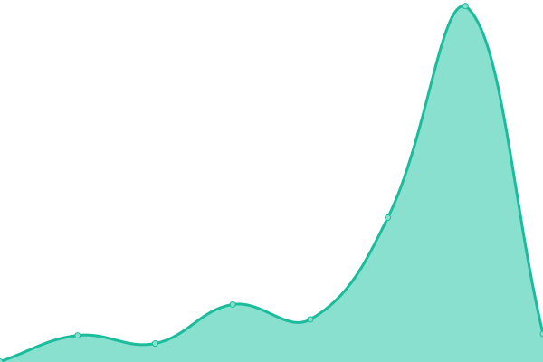
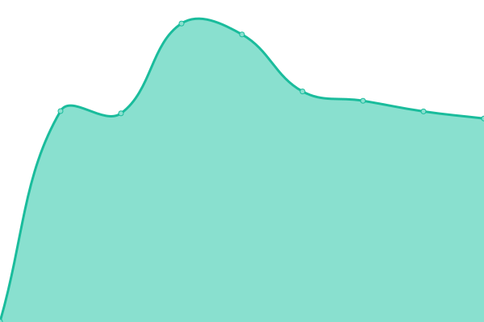
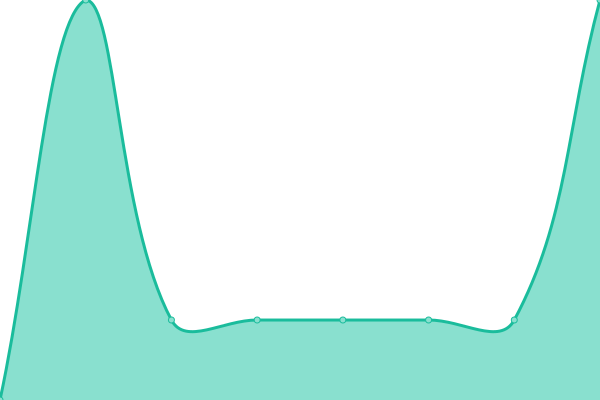
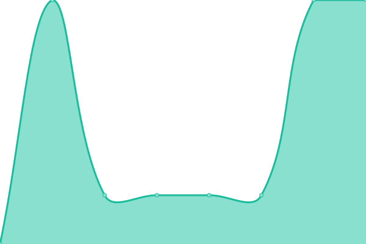

# [📈 Live Status](https://demo.upptime.js.org): <!--live status--> **🟩 All systems operational**

This repository contains the open-source uptime monitor and status page for [Upptime](https://upptime.js.org), powered by [Upptime](https://github.com/upptime/upptime).

With [Upptime](https://upptime.js.org), you can get your own unlimited and free uptime monitor and status page, powered entirely by a GitHub repository. We use [Issues](https://github.com/upptime/upptime/issues) as incident reports, [Actions](https://github.com/podcctv/upptime/actions) as uptime monitors, and [Pages](https://demo.upptime.js.org) for the status page.

<!--start: status pages-->
<!-- This summary is generated by Upptime (https://github.com/upptime/upptime) -->
<!-- Do not edit this manually, your changes will be overwritten -->
<!-- prettier-ignore -->
| URL | Status | History | Response Time | Uptime |
| --- | ------ | ------- | ------------- | ------ |
|  [Google](https://www.google.com) | 🟩 Up | [google.yml](https://github.com/podcctv/upptime/commits/HEAD/history/google.yml) | 

 88ms
     
 | 

<a href="https://podcctv.github.io/upptime/history/google">100.00%</a>
    

|  [Wikipedia](https://en.wikipedia.org) | 🟩 Up | [wikipedia.yml](https://github.com/podcctv/upptime/commits/HEAD/history/wikipedia.yml) | 

 139ms
     
 | 

<a href="https://podcctv.github.io/upptime/history/wikipedia">100.00%</a>
    

|  [Serv00](https://veronicaqd.serv00.net) | 🟩 Up | [serv00.yml](https://github.com/podcctv/upptime/commits/HEAD/history/serv00.yml) | 

 641ms
     
 | 

<a href="https://podcctv.github.io/upptime/history/serv00">100.00%</a>
    

|  [4d4y](https://www.4d4y.com) | 🟩 Up | [4d4y.yml](https://github.com/podcctv/upptime/commits/HEAD/history/4d4y.yml) | 

 1058ms
     
 | 

<a href="https://podcctv.github.io/upptime/history/4d4y">100.00%</a>
    

|  [flanker.me](https://flanker.me) | 🟩 Up | [flanker-me.yml](https://github.com/podcctv/upptime/commits/HEAD/history/flanker-me.yml) | 

 813ms
     
 | 

<a href="https://podcctv.github.io/upptime/history/flanker-me">100.00%</a>
    

|  [Google DNS 1](8.8.4.4) | 🟩 Up | [google-dns-1.yml](https://github.com/podcctv/upptime/commits/HEAD/history/google-dns-1.yml) | 

 4ms
     
 | 

<a href="https://podcctv.github.io/upptime/history/google-dns-1">100.00%</a>
    

|  [Google DNS 2](8.8.8.8) | 🟩 Up | [google-dns-2.yml](https://github.com/podcctv/upptime/commits/HEAD/history/google-dns-2.yml) | 

 5ms
     
 | 

<a href="https://podcctv.github.io/upptime/history/google-dns-2">100.00%</a>
    

<!--end: status pages-->

[**Visit our status website →**](https://demo.upptime.js.org)

## 📄 License

- Powered by: [Upptime](https://github.com/upptime/upptime)
- Code: [MIT](./LICENSE) © [Anand Chowdhary](https://anandchowdhary.com), supported by [Pabio](https://pabio.com)
- Data in the `./history` directory: [Open Database License](https://opendatacommons.org/licenses/odbl/1-0/)
